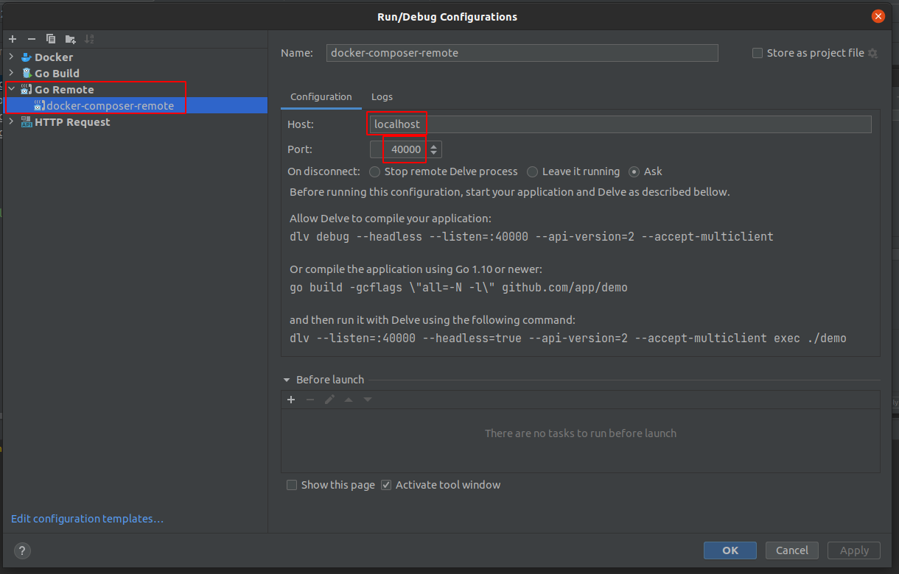
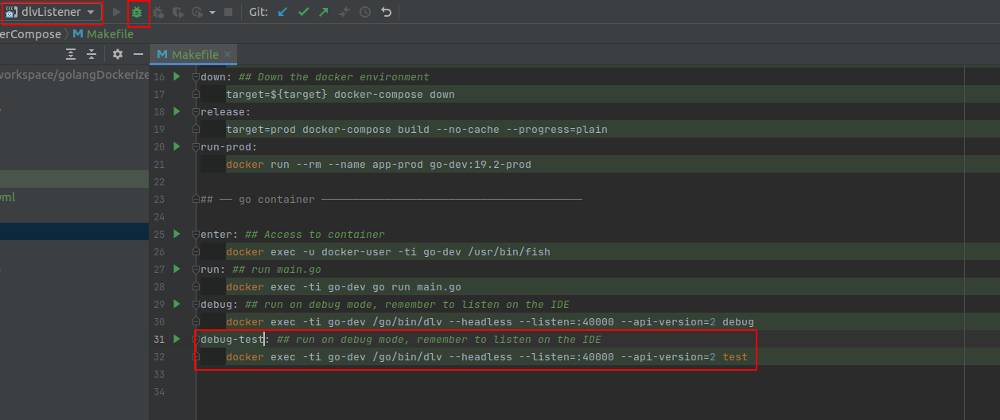

## 1. docker-compose 

#### References
* https://blog.jetbrains.com/go/2020/05/08/running-go-applications-using-docker-compose-in-goland/
* https://github.com/asspirin12/dockerdev/blob/compose/docker-compose.yml

### In this project

Run in terminal

    cd withDockerCompose &&  make up

this will build and startup the dev container with docker compose. you will have a container with go and delve.

you can enter with 

    make enter

run the code on the container listen to 8000 port 

    make debug

or run it on debug mode 

    make debug 

or debug tests make 

    debug-test

dlv will be listening on port 40000 so you need to configure the ide to listen this port: 

and then put in listening mode:

## 2. Dockerfiles

> WIP... this section is in draft mode

with the Dockerfiles and IDE configuration method you must to mind the amount of containers created. I have pending to investigate to recreate with the same name or delete the previus one.

## references

* https://www.youtube.com/watch?v=iFgJmMV9Gxw

Now the sdk should be in local, and separately you can build in other target, so you need to manage the match between versions.